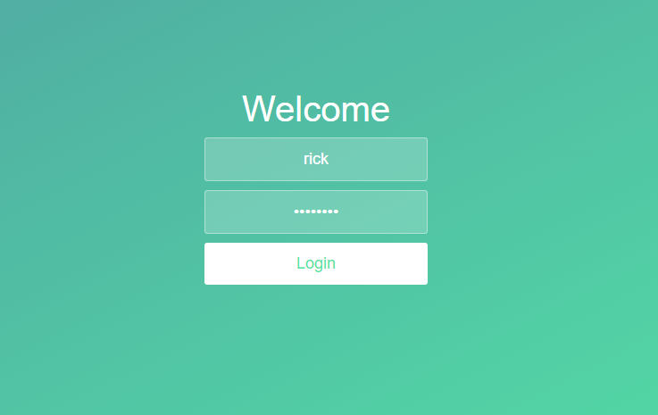
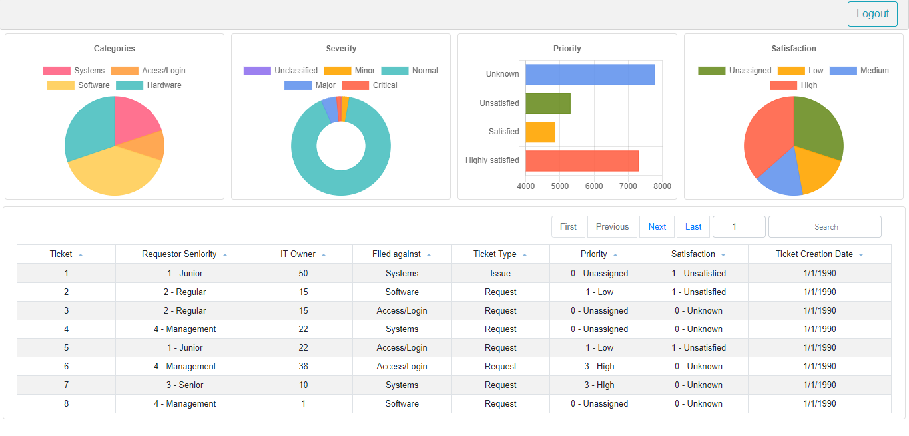
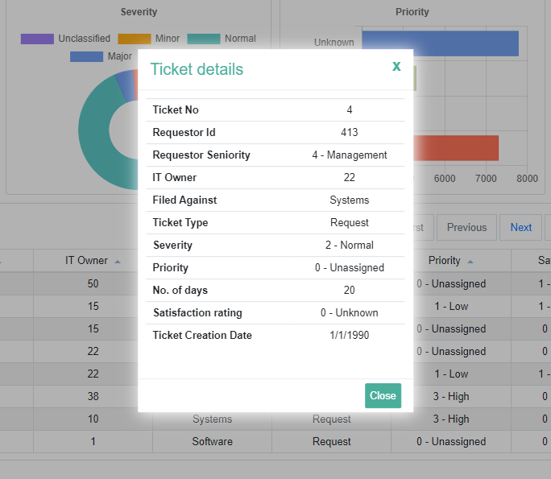

# Ticket-system : A single page application made with Vue.js










## Project setup

### Clone the repository

```
git clone https://github.com/shashankdhar/ticket-system.git
```

### Install dependencies 

```
npm install
```

### Run the app in development mode.

```
npm run serve
```

### Builds the app for production to the build folder.

```
npm run build
```
